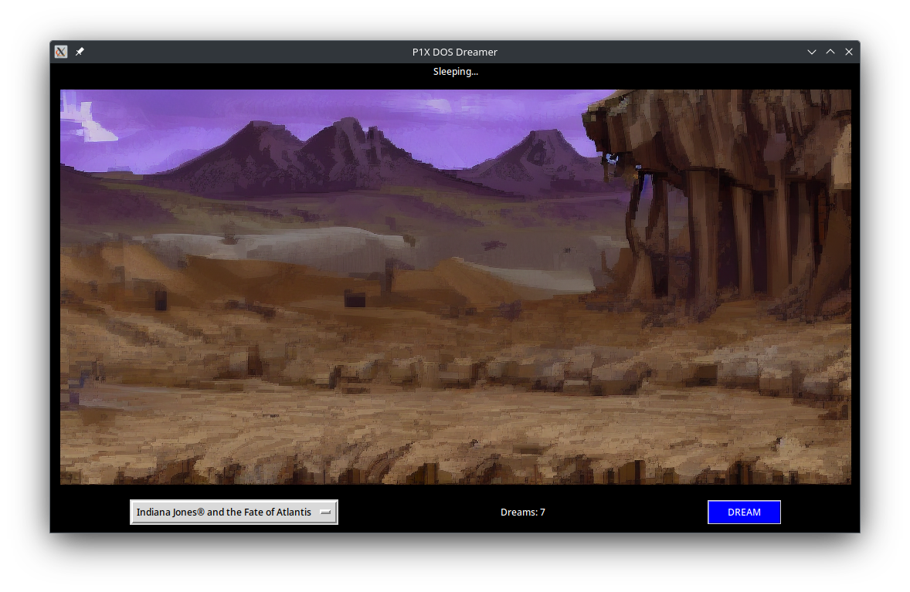
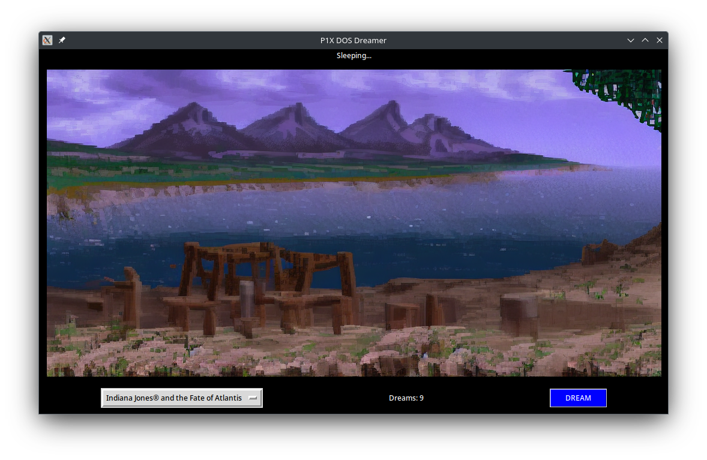
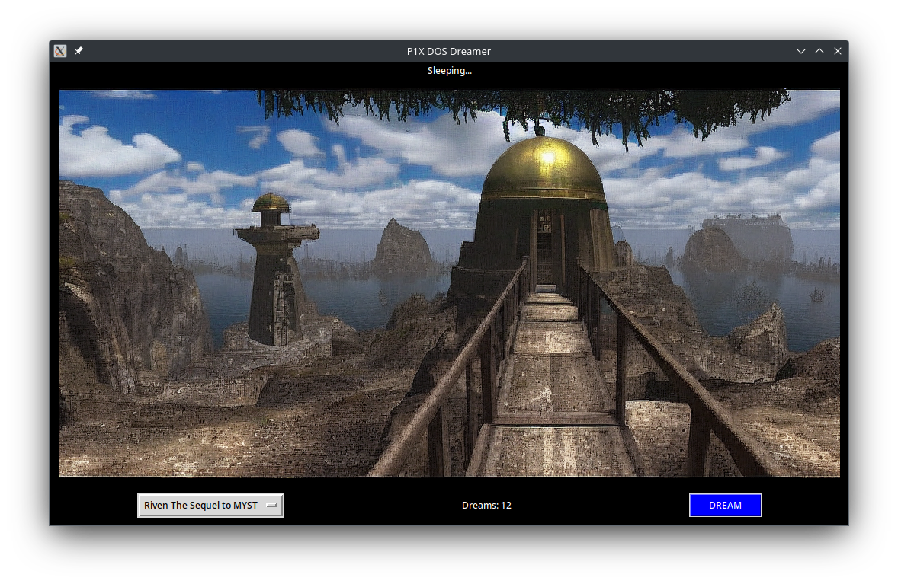
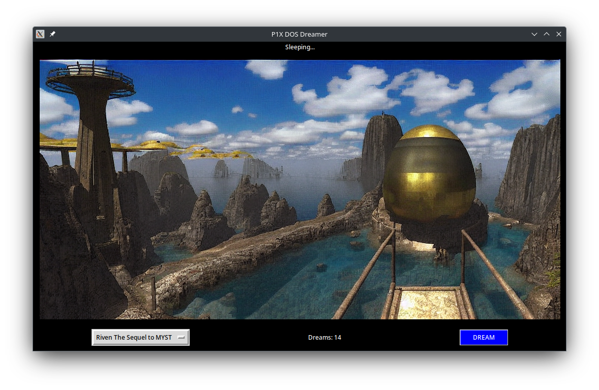
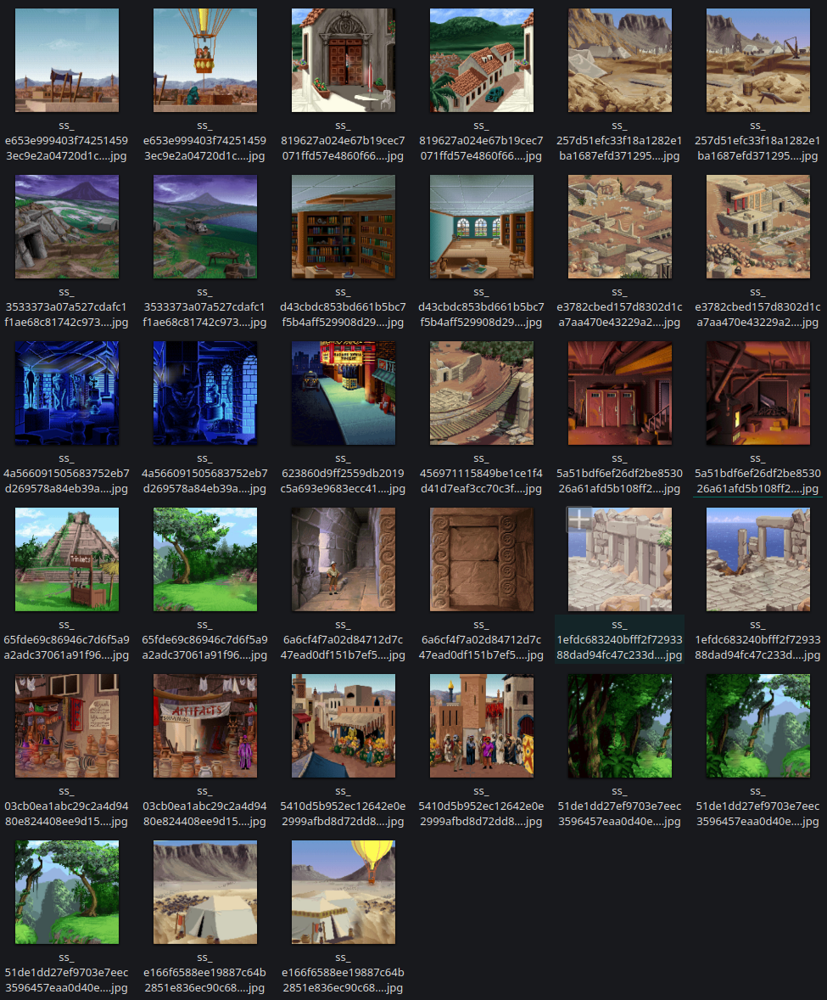
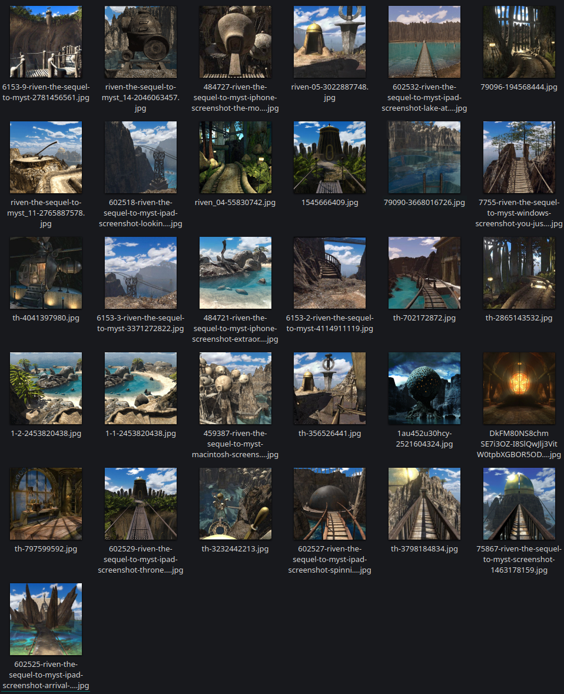

# P1X DOS Dreamer
App for connecting to the Stable Diffusion API and generaing DOS adventure games backgrounds.

- automatic1111 webUI compatibility
- uses model trained by myself
- models:
    - Based on [Indiana Jones® and the Fate of Atlantis](https://store.steampowered.com/app/6010/Indiana_Jones_and_the_Fate_of_Atlantis/)
    - TODO: Based on [Riven The Sequel to MYST](https://store.steampowered.com/app/63610/Riven_The_Sequel_to_MYST/)

## Datasets

